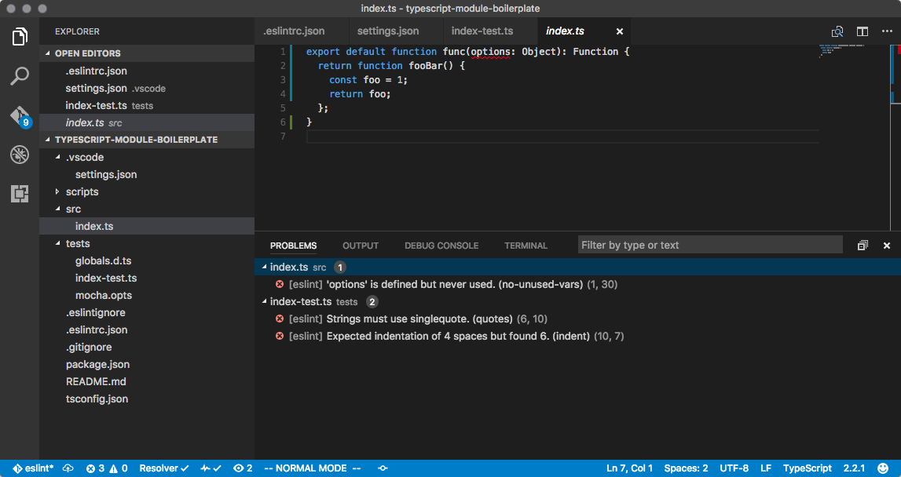

# typescript-module-boilerplate

This is a boilerplate module for a project that uses TypeScript as its main language. To use this boilerplate, clone, delete `.git` folder and begin your own. Maybe delete a few other extra files as necessary.

## Stack Description

* TypeScript
* Jest
* Prettier
* ESLint

## Usage

```bash
$ git clone https://github.com/alexgorbatchev/typescript-module-boilerplate.git
$ cd typescript-module-boilerplate
$ rm -fr .git
$ yarn
$ yarn test
```

## Features



* Linting via [ESLint](http://eslint.org/).
  * Run manually via `yarn lint`.
  * Integrates with Visual Studio Code via [vscode-eslint](https://github.com/Microsoft/vscode-eslint/).
    * Highlights type & linting issues.
    * Provides debuging options for running Jest tests (once and in watch mode).
  * Uses [AirBNB ESLint plugin](https://github.com/airbnb/javascript) as sane defaults.
  * `import ... from ...` statements are verified for correctness via [eslint-plugin-import](https://github.com/benmosher/eslint-plugin-import).
* Formatting via [Prettier](https://github.com/prettier/prettier).
  * Run manually via `yarn format`.
  * Integrates well with Visual Studio Code via [prettier-vscode](https://github.com/prettier/prettier-vscode).
    * Automatically formats on save.

## Script Commands

* `yarn test` -- Runs tests.
* `yarn typecheck` -- Checks TypeScript types for correctness. This is disabled during tests for performance reasons.
* `yarn lint` -- Runs linting.
* `yarn format` -- Reformats all of the `.ts` and `.tsx` files with Prettier.
* `yarn build` -- Regenerates `dist` folder that gets included into NPM module.

## License

MIT
